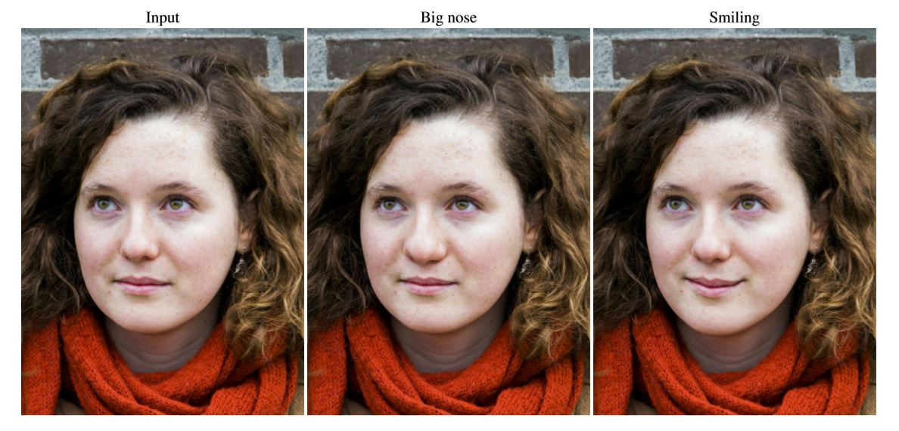
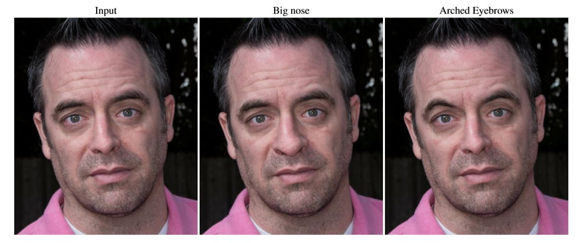

<p align="center"></p>

--------------------------------------------------------------------------------
This repository provides the tensorflow implementation of the following paper:<br/>
The GAN that Warped: Semantic Attribute Editing with Unpaired Data
Garoe Dorta Sara Vicente Neill D.F. Campbell Ivor J.A. Simpson 

## Requirements
* Tensorflow 1.8
* Python 3.6

## Usage
### Downloading the dataset
```python
> python download.py celebA
```

```
├── dataset
   └── celebA
       ├── train
           ├── 000001.jpg 
           ├── 000002.jpg
           └── ...
       ├── test (It is not celebA)
           ├── a.jpg (The test image that you wanted)
           ├── b.png
           └── ...
       ├── list_attr_celeba.txt (For attribute information) 
```

### Train
* python main.py --phase train

### Test
* python main.py --phase test 
* The celebA test image and the image you wanted run simultaneously

## Results (128x128)
### Women


### Men


## Reference
* [WarpGAN paper](https://garoe.github.io/papers/warp_gan_2020.pdf)


The framework referenced the <a href='https://github.com/taki0112/StarGAN-Tensorflow' target='_blank'>StarGAN-Tensorflow</a> has been completed, but I can't get the same result as the paper. So you can refer to it. If you find some problem in the code, please contact me: wwkang94@alumni.sjtu.edu.cn 
